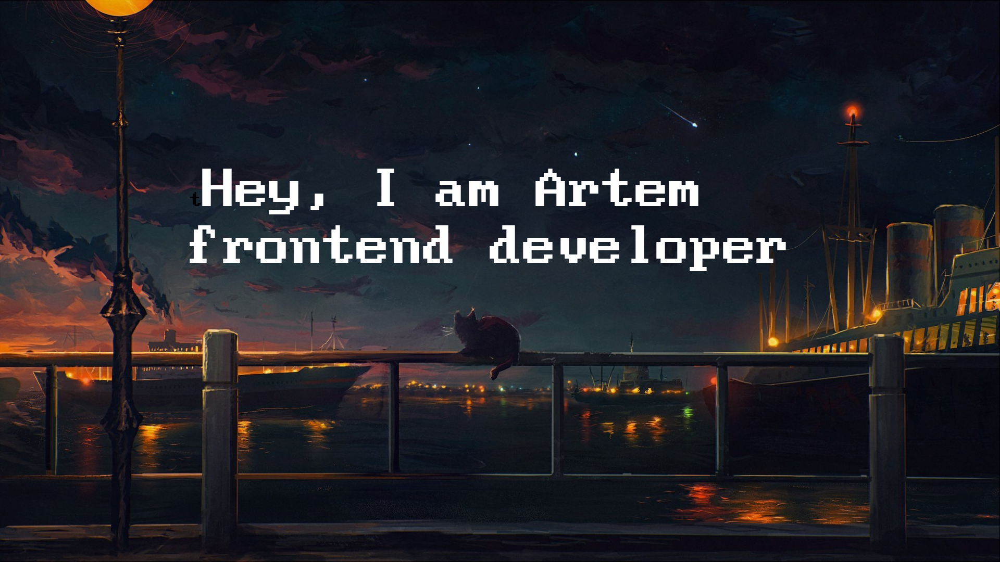

<table>
  <tr>
    <td style="vertical-align: top; padding: 10px;">
      <h3>🎓 Currently Learning</h3>
      <ul>
        <li>TypeScript</li>
        <li>JavaScript</li>
        <li>React</li>
        <li>Algorithms</li>
      </ul>
    </td>
    <td style="vertical-align: top; padding: 10px;">
      <h3>💼 Looking to Collaborate On</h3>
      <ul>
        <li>Open-source projects 🤝</li>
        <li>Hackathons 💻</li>
        <li>Innovative web applications 🚀</li>
        <li>Learning resources for developers 🗂️</li>
      </ul>
    </td>
    <td style="vertical-align: top; padding: 10px;">
      <h3>🚴‍♂️ Hobbies </h3>
      <ul>
        <li>Gym 🏋</li>
        <li>Athletics 🏃‍♂️</li>
        <li>Math ♾️</li>
        <li>Camping 🚙</li>
      </ul>
    </td>
    <td style="vertical-align: top; padding: 10px;">
     <h3>📧 Contacts</h3>
     <ul>
      <li><a href="mailto:artem_fedchenko_2017@mail.ru">Email</a></li>
      <li><a href="https://t.me/fedddchenko">Telegram</a></li>
     </ul>
    </td>
  </tr>
</table>

<h3>⚡ Fun Fact</h3>

I love discovering new hobbies and interests. Currently, I'm studying pen-spinning and experimenting with new recipes in the kitchen.

